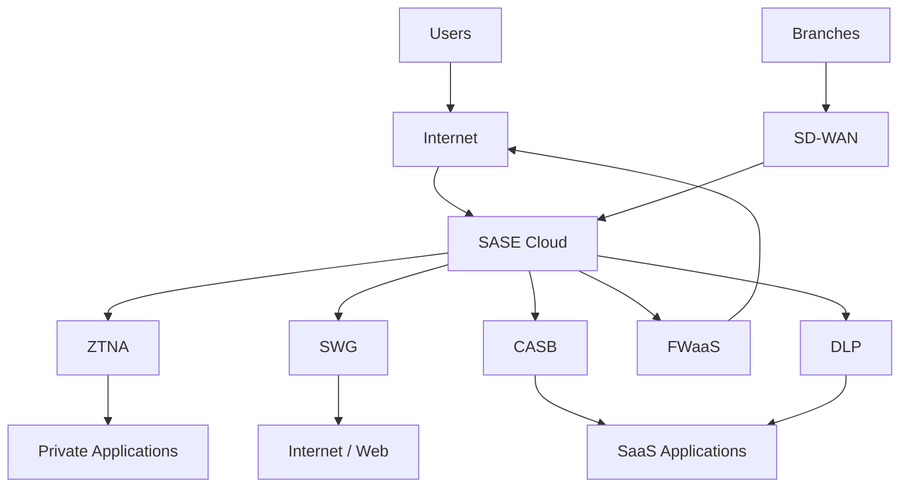

# SASE — Secure Access Service Edge
## Zero to Hero | Network Zero to Hero Series

---

## Table of Contents

1. What is SASE?
2. Why SASE Emerged
3. Traditional Network vs SASE
4. SASE Architecture
5. SASE Core Components
6. SD-WAN
7. SSE
8. ZTNA
9. Zero Trust
10. SWG
11. CASB
12. FWaaS
13. DLP
14. SASE vs SSE vs SD-WAN
15. VPN vs ZTNA
16. SASE Traffic Flows
17. Remote User to Internet
18. Remote User to SaaS
19. Remote User to Private Application
20. Branch to Internet
21. Branch to Private Application
22. Identity in SASE
23. Device Posture
24. Policy Decision
25. SASE and Zscaler
26. Real-World Example
27. SASE Troubleshooting Methodology
28. Real-World Troubleshooting Scenarios
29. Common SASE Problems
30. Interview Questions and Answers
31. Senior-Level Scenario Questions
32. Quick Revision Sheet
33. Final Mental Model

---

# 1. What is SASE?

**SASE = Secure Access Service Edge**

SASE is a networking and security architecture that combines:

- Network connectivity
- WAN connectivity
- Cloud-delivered security
- Identity-based access
- Application-aware security
- Centralized policy

Instead of depending only on a traditional data-center perimeter, SASE provides security and connectivity closer to users, branches, applications and cloud services.

### Simple definition

> **SASE combines networking and security capabilities into a cloud-centric architecture where access is controlled using identity, device, context and security policy.**

---

# 2. Why SASE Emerged

Traditional enterprise networks were designed around:

```text
Users
  |
Office Network
  |
Corporate WAN
  |
Data Center
  |
Firewall
  |
Internet
```

Most applications were hosted inside the corporate data center and users were mostly inside corporate offices.

Modern enterprise:

```text
                  USERS
                    |
        +-----------+-----------+
        |           |           |
      Office      Home        Mobile
        |           |           |
        +-----------+-----------+
                    |
                Internet
                    |
       +------------+-------------+
       |            |             |
      SaaS          AWS           Azure
       |            |             |
       +------------+-------------+
```

Applications are distributed across data centers, AWS, Azure, SaaS, Internet and private cloud.

Users work from offices, homes, branches and mobile locations.

This made traditional perimeter-centric architectures less efficient for many use cases.

---

# 3. Traditional Network vs SASE

## Traditional Architecture

```text
Remote User
     |
  Internet
     |
Data Center
     |
  Firewall
     |
Internet
     |
SaaS
```

Internet traffic may be backhauled through the corporate data center.

### Problems

- Additional latency
- Increased bandwidth usage
- Data-center dependency
- Increased firewall load
- Poor SaaS performance
- More complex architecture

## Modern SASE Architecture

```text
Remote User
     |
  Internet
     |
SASE Cloud
     |
     +------------------+
     |                  |
 Security           Application
 Policy                Access
     |                  |
 Internet          Private App
   / SaaS
```

The security enforcement point can be closer to the user.

---

# 4. SASE Architecture



---

# 5. SASE Core Components

Think of SASE as:

```text
                       SASE
                         |
             +-----------+-----------+
             |                       |
        Networking                 Security
             |                       |
          SD-WAN                    SSE
                                     |
                    +----------------+----------------+
                    |                |                |
                   ZTNA             SWG              CASB
                    |                |                |
              Private Apps          Web              SaaS
```

| Component | Main Purpose |
|---|---|
| SD-WAN | WAN connectivity and intelligent path selection |
| SSE | Cloud-delivered security |
| ZTNA | Secure access to private applications |
| SWG | Secure Internet/Web access |
| CASB | SaaS/Cloud security |
| FWaaS | Cloud-delivered firewall |
| DLP | Prevent sensitive data leakage |
| Zero Trust | Identity/context-based trust model |

---

# 6. SD-WAN

**SD-WAN = Software-Defined Wide Area Network**

SD-WAN provides:

- WAN connectivity
- Centralized policy
- Application-aware routing
- Dynamic path selection
- Link monitoring
- Traffic steering

Example:

```text
                 Branch
                   |
              SD-WAN Edge
                   |
        +----------+----------+
        |          |          |
       MPLS     Internet      LTE
```

SD-WAN can evaluate:

- Latency
- Jitter
- Packet loss
- Availability
- Bandwidth
- Application requirements

### Underlay

The actual physical/IP connectivity:

```text
MPLS
Internet
Broadband
LTE
```

### Overlay

Logical tunnels built over the underlay:

```text
Branch A
    |
    |========= Overlay Tunnel =========|
    |                                   |
    |                                Branch B
```

---

# 7. SSE

**SSE = Security Service Edge**

SSE represents the security-focused portion of SASE.

```text
                 SASE
                   |
        +----------+----------+
        |                     |
    Networking             Security
        |                     |
     SD-WAN                  SSE
                              |
                +-------------+-------------+
                |             |             |
               ZTNA          SWG           CASB
```

SSE commonly includes:

- ZTNA
- SWG
- CASB
- Security controls
- DLP
- Threat protection

---

# 8. ZTNA

**ZTNA = Zero Trust Network Access**

ZTNA provides secure access to private applications.

### Traditional VPN

```text
User
 |
VPN
 |
Corporate Network
 |
+---------+---------+---------+
|         |         |         |
App A    App B    Server C  Server D
```

### ZTNA

```text
User
 |
ZTNA
 |
+---------+---------+
|                   |
App A              App B
ALLOW              DENY
```

The user gets access to the required application rather than broad network access.

---

# 9. Zero Trust

Zero Trust is a security model based on:

> **Never trust automatically. Always verify.**

Traditional:

```text
Inside Network
      |
      v
Trusted User
```

Zero Trust:

```text
User
 |
Identity Verification
 |
Device Verification
 |
Application Request
 |
Policy Evaluation
 |
 +--------+--------+
 |                 |
ALLOW             DENY
```

Decision factors can include:

- User identity
- Device identity
- Device posture
- Application
- Location
- Time
- Risk
- Authentication status
- Security policy

---

# 10. SWG

**SWG = Secure Web Gateway**

SWG secures user access to Internet/Web resources.

```text
User
 |
Internet
 |
 v
SWG
 |
Security Inspection
 |
 v
Internet
 |
 v
Website
```

SWG can provide:

- URL filtering
- Web filtering
- Malware protection
- Security inspection
- Policy enforcement
- SSL inspection
- Logging

---

# 11. CASB

**CASB = Cloud Access Security Broker**

CASB provides visibility and security controls for cloud applications.

```text
User
 |
 v
CASB
 |
 +----------+----------+
 |          |          |
M365     Salesforce   SaaS
```

CASB can help with:

- SaaS visibility
- Cloud application control
- Data protection
- Access control
- Shadow IT visibility
- Compliance

---

# 12. FWaaS

**FWaaS = Firewall as a Service**

Instead of relying only on a physical firewall:

```text
User
 |
Data Center
 |
Firewall
 |
Internet
```

Security controls can be delivered from a cloud service:

```text
User
 |
Internet
 |
Cloud Firewall
 |
Internet / Application
```

FWaaS provides firewall-like policy enforcement as a cloud service.

---

# 13. DLP

**DLP = Data Loss Prevention**

DLP protects sensitive information from unauthorized transfer.

```text
Employee
    |
Upload File
    |
    v
DLP Inspection
    |
    +-------------+
    |             |
Normal File   Sensitive Data
    |             |
  ALLOW          BLOCK
```

DLP can inspect data such as:

- Personal information
- Financial information
- Confidential documents
- Source code
- Company-sensitive data

---

# 14. SASE vs SSE vs SD-WAN

## SD-WAN

Focuses on:

```text
WAN connectivity
Path selection
Traffic steering
Application routing
```

Question it answers:

> **Which path should this traffic use?**

## SSE

Focuses on:

```text
Security
ZTNA
SWG
CASB
DLP
```

Question it answers:

> **How should this traffic/user be secured?**

## SASE

Combines:

```text
Networking
+
Security
+
Identity
+
Policy
+
Cloud delivery
```

Therefore:

> **SD-WAN and SASE are not the same thing. SD-WAN can be part of a SASE architecture.**

---

# 15. VPN vs ZTNA

## Traditional VPN

```text
User
 |
VPN Tunnel
 |
Corporate Network
 |
Multiple Resources
```

VPN typically provides network-level connectivity.

## ZTNA

```text
User
 |
Identity
 |
ZTNA
 |
Application
```

ZTNA provides application-specific access based on identity and policy.

### Interview Answer

> VPN generally provides network-level remote connectivity, while ZTNA provides identity- and policy-based access to specific private applications without necessarily exposing the entire corporate network.

---

# 16. SASE Traffic Flows

Four important flows:

1. Remote User → Internet
2. Remote User → SaaS
3. Remote User → Private Application
4. Branch → Application/Internet

---

# 17. Remote User to Internet

```text
Laptop
  |
  v
Internet
  |
  v
SASE Cloud
  |
  v
SWG
  |
Security Policy
  |
Inspection
  |
  v
Internet
  |
  v
example.com
```

Security checks can include:

```text
User Identity
Destination
URL
Category
Threat
Policy
```

Then:

```text
ALLOW
   or
BLOCK
```

---

# 18. Remote User to SaaS

```text
User
 |
Internet
 |
SASE
 |
SWG / CASB
 |
Security Policy
 |
SaaS
```

For example:

```text
User
 |
SASE
 |
CASB
 |
Microsoft 365
```

CASB can provide visibility and control over cloud/SaaS usage.

---

# 19. Remote User to Private Application

```text
Remote User
     |
 Internet
     |
     v
SASE
     |
Identity
     |
Device Posture
     |
Policy
     |
ZTNA
     |
     v
Private Application
     |
Data Center
```

Example:

```text
User
 |
ZTNA
 |
HR Application  -> ALLOW
Finance App     -> DENY
Database        -> DENY
```

---

# 20. Branch to Internet

```text
Branch
 |
SD-WAN Edge
 |
+--------+--------+
|        |        |
MPLS  Internet   LTE
 |
SD-WAN Policy
 |
SASE
 |
Security Inspection
 |
Internet
```

SD-WAN determines the WAN path.

SASE/SSE provides security.

---

# 21. Branch to Private Application

```text
Branch
 |
SD-WAN
 |
SASE
 |
Security Policy
 |
Private Application
 |
Data Center / Cloud
```

Possible decision factors:

```text
Application
Latency
Jitter
Packet Loss
Policy
Identity
Security
```

---

# 22. Identity in SASE

Traditional networking often focuses on:

```text
Source IP
Destination IP
Port
Protocol
```

SASE/Zero Trust adds:

```text
Who is the user?
What device?
Which application?
What is the device posture?
Where is the user?
What policy applies?
```

Example:

```text
User = Alice
Device = Company Laptop
Application = Finance
Authentication = Successful
Device Compliance = Good
```

Policy:

```text
IF
User authorized
AND
Device compliant
AND
Application permitted

THEN
ALLOW
```

---

# 23. Device Posture

Device posture means evaluating the security state of the endpoint.

Possible checks:

```text
Operating System
Antivirus
EDR
Encryption
Patch level
Device management
Certificate
Security compliance
```

Example:

```text
User
 |
Device
 |
+-------------------------+
| Corporate managed?      |
| Antivirus running?      |
| OS compliant?           |
| Certificate valid?      |
+-------------------------+
 |
 v
Policy Decision
```

---

# 24. Policy Decision

```text
              REQUEST
                 |
                 v
       +---------------------+
       | Identity            |
       | Device              |
       | Application         |
       | Context             |
       | Security Policy     |
       +----------+----------+
                  |
          +-------+-------+
          |               |
        ALLOW            DENY
```

---

# 25. SASE and Zscaler

Zscaler is an example of a cloud-delivered security platform used for services such as:

- Secure Internet access
- Zero Trust access
- Cloud security
- Web security
- Application access

For a user with Zscaler client software:

```text
User Device
     |
Zscaler Client
     |
Internet
     |
Zscaler Cloud
     |
Security Policy
     |
Internet / Private Application
```

## ZIA

**ZIA = Zscaler Internet Access**

Conceptually:

```text
User
 |
ZIA
 |
Internet
```

ZIA primarily provides secure Internet access.

Examples of policy controls:

```text
URL Filtering
Web Security
SSL Inspection
Malware Protection
Cloud Firewall
```

## ZPA

**ZPA = Zscaler Private Access**

Conceptually:

```text
User
 |
ZPA
 |
Private Application
```

ZPA is aligned with Zero Trust access to private applications.

Important distinction:

```text
ZIA → Internet
ZPA → Private Applications
```

---

# 26. Real-World Example

Consider:

```text
5000 Employees
100 Branches
AWS
Azure
SaaS
Data Center
```

Traditional:

```text
Users
 |
Branch
 |
MPLS
 |
Data Center
 |
Firewall
 |
Internet
 |
SaaS
```

SASE:

```text
                         SASE
                           |
          +----------------+----------------+
          |                                 |
       SD-WAN                              SSE
          |                                 |
   +------+------+                +---------+---------+
   |      |      |                |         |         |
 MPLS  Internet LTE              ZTNA      SWG       CASB
                                   |         |         |
                             Private Apps   Web       SaaS
```

Benefits:

- Better scalability
- Cloud-based security
- Reduced backhauling
- Centralized policy
- Better remote-user security
- Application-aware access
- Identity-based access
- Better visibility

---

# 27. SASE Troubleshooting Methodology

Use a layered approach:

```text
User
 |
Endpoint
 |
Internet Connectivity
 |
DNS
 |
Authentication
 |
Device Posture
 |
SASE Policy
 |
ZTNA / SWG / CASB
 |
Connector
 |
Firewall
 |
Routing
 |
Application
```

## Step 1 — Define Scope

Ask:

```text
One user?
Multiple users?
One application?
All applications?
One location?
All locations?
```

## Step 2 — Check Endpoint

Check:

```text
IP Address
Default Gateway
DNS
Client Agent
Authentication
Certificate
Endpoint Security
```

## Step 3 — Check Internet

Useful tests:

```text
ping
nslookup
traceroute
curl
```

## Step 4 — Check DNS

If:

```text
IP works
Hostname doesn't work
```

Investigate DNS.

## Step 5 — Check Authentication

Check:

```text
Username
MFA
Identity Provider
Authentication Logs
```

## Step 6 — Check Device Posture

Check:

```text
Device Compliance
EDR
Antivirus
Certificate
OS
Management Status
```

## Step 7 — Check Policy

Check:

```text
User Policy
Group Policy
Application Policy
URL Policy
Security Policy
```

## Step 8 — Check SASE Logs

Look for:

```text
Allowed
Blocked
Authentication failure
Policy mismatch
SSL inspection issue
Application error
```

## Step 9 — Check Private Application Path

For ZTNA:

```text
User
 |
SASE
 |
ZTNA
 |
Connector
 |
Firewall
 |
Server
 |
Application
```

---

# 28. Real-World Troubleshooting Scenarios

## Scenario 1 — User Cannot Browse Internet

Troubleshoot:

```text
1. Check endpoint connectivity
2. Check DNS
3. Check SASE client/agent
4. Check authentication
5. Check security policy
6. Check URL filtering
7. Check SSL inspection
8. Check SASE logs
```

## Scenario 2 — User Can Browse Google But Not a Specific Website

Internet is working, so focus on:

```text
DNS
URL Filtering
Category
Security Policy
SSL Inspection
Malware Policy
Application-specific restrictions
```

## Scenario 3 — Remote User Cannot Access Internal Application

```text
1. Internet
2. DNS
3. Authentication
4. Device posture
5. ZTNA policy
6. Application authorization
7. Connector
8. Firewall
9. Routing
10. Server/Application
```

## Scenario 4 — User Authenticated but Application Denied

Possible causes:

```text
Wrong policy
Wrong user group
Application not published
Device posture failure
Authorization failure
Connector issue
```

## Scenario 5 — SASE Works but Private Application Is Slow

Check:

```text
Endpoint
 |
Internet
 |
SASE
 |
ZTNA
 |
Connector
 |
WAN
 |
Firewall
 |
Server
 |
Application
```

Investigate:

```text
Latency
Packet Loss
Jitter
Bandwidth
Routing
MTU
Firewall inspection
Server performance
Application performance
```

## Scenario 6 — One User Has Problem, Everyone Else Works

Focus on:

```text
User Account
Device
Authentication
MFA
Client Agent
Certificate
Device Posture
Group Membership
Policy
```

## Scenario 7 — All Users Have Problem

Check:

```text
SASE Service
Authentication
Policy
DNS
Connectivity
Service Health
Recent Changes
```

---

# 29. Common SASE Problems

| Problem | Possible Cause |
|---|---|
| No Internet | Client/SASE/DNS/policy |
| Specific website blocked | URL/security policy |
| SaaS unavailable | CASB/SWG/policy |
| Private app unavailable | ZTNA/policy/connector |
| Authentication failure | IdP/MFA |
| Device denied | Device posture |
| Slow application | Latency/loss/routing/server |
| SSL errors | SSL inspection/certificate |
| Branch outage | SD-WAN/underlay/overlay |
| One user affected | User/device/policy |
| Everyone affected | Service/policy/identity/infrastructure |

---

# 30. Interview Questions and Answers

## Q1. What is SASE?

> SASE, or Secure Access Service Edge, is an architecture that combines networking and security capabilities, often delivered through cloud services, to provide secure connectivity based on identity, context and policy.

## Q2. Is SASE a device?

> No. SASE is an architecture and service model rather than a single physical device.

## Q3. What are the major components of SASE?

> Major components include SD-WAN for networking and traffic steering, and security services such as ZTNA, SWG, CASB, FWaaS and DLP.

## Q4. What is SSE?

> SSE, or Security Service Edge, represents the security-focused portion of SASE and commonly includes capabilities such as ZTNA, SWG and CASB.

## Q5. What is ZTNA?

> ZTNA provides identity- and policy-based access to private applications without necessarily giving users broad access to the underlying corporate network.

## Q6. What is Zero Trust?

> Zero Trust means we don't automatically trust a user or device based on its network location. Access is evaluated using identity, device posture, application, context and policy.

## Q7. What is SWG?

> Secure Web Gateway protects users accessing Internet and web resources by enforcing security policies such as URL filtering, threat inspection and web access control.

## Q8. What is CASB?

> CASB provides visibility and security controls for cloud and SaaS applications, including access control, data protection and cloud application monitoring.

## Q9. What is the difference between SASE and SD-WAN?

> SD-WAN primarily focuses on WAN connectivity, path selection and traffic steering, while SASE is broader and combines networking with cloud-delivered security and identity-based access.

## Q10. What is the difference between SASE and SSE?

> SASE includes both networking and security capabilities. SSE focuses specifically on the security services portion of the architecture.

## Q11. VPN vs ZTNA?

> VPN generally provides network-level remote connectivity, while ZTNA provides application-specific access based on identity, device and security policy.

## Q12. Why did SASE emerge?

> SASE emerged because users and applications became distributed across offices, remote locations, cloud and SaaS environments. Traditional perimeter-based architectures often required traffic backhauling through data centers. SASE provides a more distributed, cloud-centric approach to networking and security.

## Q13. What is the role of identity in SASE?

> Identity is a major policy input. Instead of relying only on source IP, SASE can evaluate the user, device, application, location, posture and other context before allowing access.

## Q14. What is device posture?

> Device posture represents the security and compliance state of an endpoint, such as whether it is managed, patched, encrypted and running required security controls.

---

# 31. Senior-Level Scenario Questions

## Scenario 1

**Question:** A remote user can browse the Internet but cannot access an internal application. What do you check?

**Strong Answer:**

> "Since Internet connectivity is already working, I would first determine whether the issue is specific to the private application. I'd verify DNS resolution, user authentication, device posture and ZTNA authorization. Then I'd check the applicable ZTNA policy, application publication and connector reachability. After that I'd validate the firewall, routing and application-side connectivity and review the SASE/ZTNA logs to identify where the request is being denied or failing."

## Scenario 2

**Question:** A user can access Google but not Salesforce. What do you check?

**Answer:**

> "Since general Internet access is working, I'd focus on the application-specific path. I'd verify DNS, URL/security policy, user authorization, CASB/SWG policy, SSL inspection and any application-specific restrictions. I'd also check the SASE logs and confirm whether the traffic is being blocked or whether the SaaS application itself is experiencing an issue."

## Scenario 3

**Question:** All users suddenly lose Internet access through SASE.

**Answer:**

> "I'd first establish whether the issue affects all users and locations. Then I'd check SASE service health, authentication/identity-provider status, DNS, recent policy changes and Internet/underlay connectivity. I'd review centralized logs and monitoring to identify whether the failure is service-wide or caused by a recent configuration change."

## Scenario 4

**Question:** One user cannot access a private application but everyone else can.

**Answer:**

> "Because the issue is isolated to one user, I'd focus first on user identity, group membership, authentication, MFA, endpoint posture, client agent status and user-specific policy. I'd compare the affected user's policy and device state against a working user."

## Scenario 5

**Question:** Private application works but is very slow for remote users.

**Answer:**

> "I'd determine whether the issue is user-specific or global and measure latency, packet loss and jitter across the path. I'd check the endpoint, Internet path, SASE point of presence, ZTNA connector, WAN, firewall and server. I'd also verify routing, MTU, bandwidth utilization and application/server performance."

---

# 32. Quick Revision Sheet

### SASE

```text
Networking + Security + Identity + Policy
```

### SD-WAN

```text
WAN connectivity
Path selection
Traffic steering
```

### SSE

```text
Security-focused SASE
```

### ZTNA

```text
Private application access
```

### SWG

```text
Secure Internet/Web access
```

### CASB

```text
SaaS/Cloud security
```

### FWaaS

```text
Cloud-delivered firewall
```

### DLP

```text
Prevent sensitive data leakage
```

### Zero Trust

```text
Never trust automatically
Always verify
```

---

# 33. Final Mental Model

```text
                         SASE
                           |
              +------------+------------+
              |                         |
          NETWORKING                  SECURITY
              |                         |
           SD-WAN                      SSE
              |                         |
       +------+-------+          +------+-------+------+
       |      |       |          |      |       |      |
      MPLS Internet  LTE        ZTNA   SWG     CASB   DLP
                                  |      |       |
                                  |      |       |
                                  v      v       v
                              Private   Web     SaaS
                               Apps
```

## Final Interview Definition

> **"SASE stands for Secure Access Service Edge. It is an architecture that combines networking and security capabilities, typically through cloud-delivered services. SD-WAN provides the networking and intelligent traffic steering, while the security side can include SSE services such as ZTNA, SWG and CASB. The key difference from traditional perimeter-based networking is that access is increasingly based on user identity, device posture, application and context rather than simply whether the user is inside or outside the corporate network."**

## One-Line Memory Trick

```text
SD-WAN → How should traffic travel?

SWG → Is this web traffic safe?

CASB → How should SaaS access be controlled?

ZTNA → Which private application can this user access?

Zero Trust → Why should I trust this user/device?

SSE → Security services at the edge

SASE → Networking + Security + Identity + Policy
```

## SASE Troubleshooting Formula

```text
USER
 ↓
DEVICE
 ↓
INTERNET
 ↓
DNS
 ↓
IDENTITY
 ↓
DEVICE POSTURE
 ↓
SASE POLICY
 ↓
ZTNA / SWG / CASB
 ↓
CONNECTOR
 ↓
FIREWALL
 ↓
ROUTING
 ↓
APPLICATION
```

Always ask:

```text
Who is affected?
What application?
What changed?
Where does the traffic stop?
Is it allowed or denied?
What do the logs show?
```

---

## Final Summary

SASE is not simply a "cloud firewall".

It is a broader architecture combining:

```text
                    SASE
                      |
        +-------------+-------------+
        |                           |
    NETWORKING                   SECURITY
        |                           |
     SD-WAN                        SSE
                                    |
                         +----------+----------+
                         |          |          |
                        ZTNA       SWG        CASB
                         |          |          |
                     Private      Web        SaaS
                       Apps
```

The ultimate goal is:

> **Provide secure, identity-aware, policy-driven access to users, branches and applications regardless of where they are located.**
